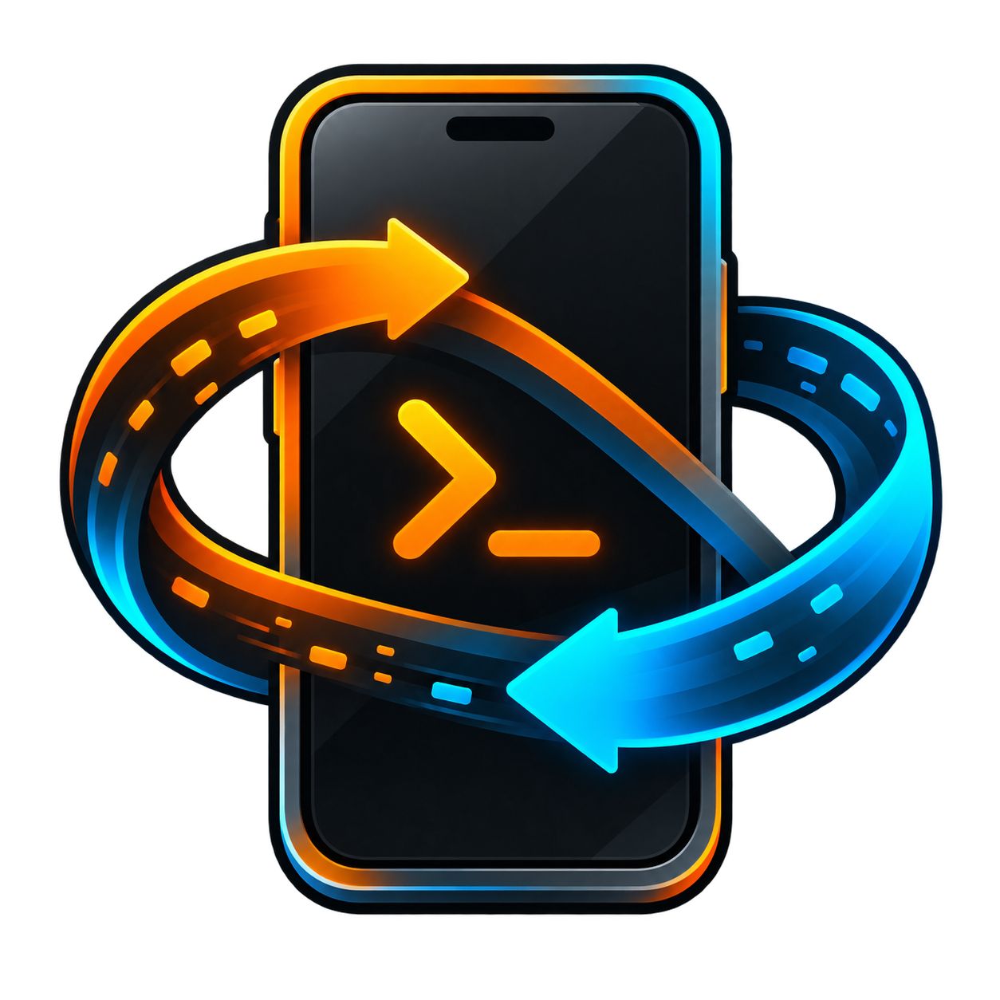

# Mobius Device Lab



Mobius Device Lab 是一个面向**已授权 Android 与越狱 iOS 测试设备**的跨平台移动设备工作台。它把设备连接、应用包分析与安装、远程文件、测试代理、端口映射、屏幕采集、系统观察和 Frida Server 生命周期管理集中到一个 Burp 风格的暗色界面中。

> 当前版本为 `0.1.0 Preview`。它适合自有测试机的应用开发、兼容性验证和设备调试，不应被视为生产级设备管理平台。

## 当前能力

| 模块 | 当前实现 | 重要说明 |
| --- | --- | --- |
| 工作区 | `工作台 / 应用 / 文件 / 网络 / 调试 / 设置` 六个稳定入口，支持 `Ctrl/⌘ K` 命令面板和 `Ctrl/⌘ 1–6` 切换 | 冷启动固定进入工作台；屏幕与连接集中在首屏，系统观察、Frida 与高级 Shell 归入“调试” |
| 工具链诊断 | 检测 `adb`、`scrcpy`、`ffmpeg`、`frida`、`aapt2`、`apkanalyzer`、`idevice_id`、`ideviceinfo`、`idevicepair`、`ideviceinstaller`、`idevicescreenshot`、`idevicesyslog`、`iproxy`、`ssh`、`scp` | 按“显式配置 → 受控/随包目录 → Android SDK → 系统 `PATH`”解析，并显示实际来源 |
| 设备识别 | 列出 Android 与 iOS 设备，读取基础状态、系统、架构与授权状态 | iOS 操作明确限定为用户拥有或获准测试的越狱设备 |
| 无线连接 | `adb pair`、`adb connect` | 配对码通过标准输入传给 ADB，不进入主机进程参数 |
| 局域网发现 | 默认识别实际 Wi-Fi/以太网的 RFC1918 私有 `/24`，扫描 5555 并执行 ADB 协议探测；必要时按优先级尝试至多 4 个活动私网 | 排除 VPN/TUN 与常见虚拟网卡；只自动连接已通过 ADB 协议确认的端点，手动地址仍作为备选 |
| 应用包分析 | 解析 APK/IPA 的包名、应用名、版本/构建、最低系统、目标 SDK、架构、MD5、权限/隐私声明和图标 | APK 优先使用 `aapt2`，再回退 `apkanalyzer` 或受限 ZIP 信息；IPA 读取 `Info.plist` 与 Mach-O |
| 安装与导出 | Android APK 安装、base/split APK 导出；iOS USB 优先 `ideviceinstaller`，LAN/USB SSH 可自动识别设备已有 `appinst` / `ipainstaller` | 可在设置中预选导出目录；不自动安装设备工具，签名、信任、越狱与 AppSync 兼容性由现有设备环境决定 |
| Android 应用管理 | 已安装应用可复制包名、启动、强制停止、导出 APK、清除数据或卸载 | 清数据/卸载要求二次确认并锁定设备与包名；系统应用在界面和后端都禁用这两项操作 |
| iOS 应用清单 | Root SSH 会话下一键读取用户/系统 App 的名称、Bundle ID、版本、Build 和 `.app` 路径 | 只读取固定 iOS 应用目录，数量和输出均有上限 |
| 端口映射 | Android 查看、创建和移除 `adb forward` / `adb reverse`；iOS 网络页提供 USB `iproxy` 本机→设备转发，以及 SSH `-L` / `-R` 两个方向的受管隧道 | Android 默认启用 `--no-rebind`；`iproxy` 主机监听绑定 `127.0.0.1`，SSH 隧道的两端均为回环；`iproxy` 不提供反向转发 |
| 屏幕 | 在“工作台”首屏默认显示当前设备：Android 使用 scrcpy Server 连续 H.264 视频，经本机回环转为内嵌画面；iOS 使用已配对 screenshotr 采样 | 手机外框始终保持紧凑纵向比例，横屏内容在框内完整适配；右侧集中屏幕操作与四种连接方式，完整设备信息收进“设备管理”。Android 缺少版本匹配的 scrcpy Server/FFmpeg 或链路中断时会明确降级为低频单帧采样；键鼠控制仍需显式打开独立 scrcpy 交互窗口 |
| Android 文件 | 浏览、上传、下载、新建目录、受限删除；本地路径由原生文件/目录选择器选取 | 删除仅允许 `/sdcard`、`/storage/emulated/<user>`、`/data/local/tmp` 的子路径；同名文件只在用户勾选后覆盖 |
| iOS SSH 文件 | 越狱设备可经 USB `iproxy` 或私网 LAN 建立 SSH 会话，浏览、传输、新建与受限删除 | 默认 root/alpine 密码登录，也可切换私钥；密码仅存于当前会话内存，不写入设置、日志或命令行 |
| Android 代理 | USB Reverse 与 Android 系统代理是两个独立动作，只有用户明确点击系统代理或组合动作才会写入设备 | 写入前保存整组 Android 全局代理快照；恢复/退出时只在当前整组状态仍等于 Mobius 设置值时回写。遇到外部新值会留住；遇到无法通过 ADB 安全恢复的 PAC 或非空排除列表会在修改前拒绝 |
| iOS 主机工具 | 调试页将 `ideviceinfo`、`idevicepair validate`、`ideviceinstaller list --all` 和限时 `idevicesyslog` 封装为设备信息、配对验证、应用列表和日志采样四个固定按钮 | 不接受任意命令；绑定当前 UDID，已配对网络设备会附加 `-n`，日志是有界采样而非无限流 |
| 系统与进程 | Android 的 `getprop`/进程快照，以及 iOS SSH 下的设备概览、进程、固定路径工具清单和最近日志均点击即读、就地展示；重启单独确认 | SSH 诊断严格绑定已验证会话并限制输出；Respring/重启显示实际 SSH 端点，并使用后端 30 秒单次确认票据 |
| Frida Server | Android 与越狱 iOS 均支持 16.1.4、最新稳定版和自定义配置槽；选择本地文件、上传为中性别名、启动、身份核验、安全停止 | Android 自动创建 loopback ADB forward；iOS 自动创建 loopback SSH forward，设备端口与主机端口均可独立设置 |

当前未实现的能力包括 ADB mDNS 自动发现、受签名工具包下载器、iOS WDA/MJPEG 高帧率录屏与操控，以及完整持久化任务日志。Android 内嵌 scrcpy 连续视频与单帧降级、iOS 已配对 screenshotr 采样、libimobiledevice 四个固定主机操作、iOS SSH 文件、受管 iOS 隧道、固定 SSH 诊断项与 Frida Server 会话管理均已接入。接入状态不等于当前环境已完成真机验收；真机通过须按发布清单另行留证。

## 最短操作路径

- 连接设备：打开应用即可在工作台右侧选择“自动发现 / 无线配对 / 手动地址 / iOS SSH”；自动发现会识别当前物理局域网、探测 5555，并连接确认到的 ADB 设备。
- 投屏、截图与录屏：工作台左侧始终保留紧凑纵向手机视图，右侧集中画面操作；全局顶部可原地切换当前设备，完整信息按需打开“设备管理”。截图可直接复制到剪贴板或保存到电脑。Android 录屏开始后持续计时，不设 20 秒固定时限，由用户点击同一按钮停止并保存；切换设备或离开页面也会自动完成保存。需要键鼠操控时再弹出 scrcpy 交互窗口。
- 创建 USB Reverse：进入 `网络 → 测试代理 → USB 反向隧道`，默认点击“仅创建 Reverse”；只有勾选或点击组合按钮时才会同时修改 Android 系统代理。
- 创建 iOS 隧道：切换到 iOS 设备后进入 `网络`。USB 设备可用 `iproxy` 让本机访问 iPhone 端口；已连接 SSH 时可用 `-L` 本地转发或 `-R` 让 iPhone 访问本机服务。列表只管理 Mobius 创建的隧道。
- 管理越狱 iOS 文件：进入 `文件`后会使用当前 USB + `iproxy` 或已登记的私网地址自动尝试默认账号密码；失败时直接展开设置，也可切换私钥。
- 分析或安装包：`应用 → 本地包`，选择 APK/IPA 后即可查看元数据，再对当前设备执行安装。
- 管理 Android 应用：`应用 → 设备应用与导出`，行内可直接复制包名、启动或停止；导出、清数据和卸载集中在“更多”。
- 导出安装包：`应用 → 设备应用与导出` 可导出 Android base/split APK；iOS 导出为 `.app` 开发分析 `tar.gz`，不是可安装 IPA。在 `设置 → 默认值` 预选目录后，导出时无需重复选择。
- 启动 Frida：顶部 `Frida`，选择版本槽和本地 Server，填写设备/主机端口后启动；转发自动完成。
- 查看 iOS 信息：进入 `调试 → iOS 工具`，无需 SSH 即可用 libimobiledevice 固定按钮查看设备信息、配对状态、应用列表和限时日志采样；建立 SSH 后再切换到越狱设备概览、进程、固定路径工具和最近日志。

## 技术架构

- 界面：React 19、TypeScript、Vite。
- 桌面容器：Tauri 2。
- 本机核心：Rust，负责参数校验、外部进程、超时、输出上限和会话资源归属。
- 外部工具：ADB、Android SDK 分析器、scrcpy/Server、FFmpeg、Frida、OpenSSH 与 libimobiledevice；它们不是 JavaScript 依赖，也不会从网页上下文直接执行。

详细设计见 [架构说明](docs/architecture.md)，已实现能力与限制见 [功能和安全边界](docs/features-and-security.md)。

## 开始开发

### 通用要求

- Node.js 22 LTS（仓库的 `.nvmrc` 已固定主版本）。
- pnpm 10.12.1 或与 `packageManager` 字段兼容的 pnpm 10 版本。
- Rust stable；仓库的 `rust-toolchain.toml` 会补齐 `rustfmt` 与 `clippy`。
- 对应操作系统的 Tauri 系统依赖。

安装 JavaScript 依赖：

```bash
pnpm install --frozen-lockfile
```

仅预览界面和模拟数据：

```bash
pnpm run dev
```

运行真实桌面应用：

```bash
pnpm run tauri dev
```

执行与 CI 相同的核心检查：

```bash
pnpm run build
cargo fmt --all --manifest-path src-tauri/Cargo.toml -- --check
cargo check --locked --all-targets --manifest-path src-tauri/Cargo.toml
cargo clippy --locked --all-targets --manifest-path src-tauri/Cargo.toml -- -D warnings
cargo test --locked --all-targets --manifest-path src-tauri/Cargo.toml
```

各平台的依赖安装方式见 [开发环境指南](docs/development.md)。

## 外部移动工具

Android 基础功能至少需要：

- Android SDK Platform Tools 中的 `adb`。
- Android SDK Build Tools 中的 `aapt2`，或 Command-line Tools 中的 `apkanalyzer`，用于完整 APK 元数据；缺失时会明确标记受限回退结果。
- 完整的 `scrcpy` 安装：内嵌视频同时需要可执行文件和与其版本匹配的 `scrcpy-server`。
- `ffmpeg`，用于将内嵌链路的 H.264 转为 WebView 可连续显示的 MJPEG；缺失时不影响单帧截图降级。
- 与目标设备 ABI 和本机 Frida 客户端严格匹配的 `frida-server`，仅动态分析时需要。

iOS 设备识别、IPA 安装与越狱设备 SSH 文件管理需要：

- `idevice_id`、`ideviceinfo` 与 `idevicepair`，用于设备发现、固定 UDID 信息读取和配对/信任验证，通常由 libimobiledevice 提供。
- `idevicescreenshot`，用于已配对 USB/网络 iOS 的内嵌采样预览与 PNG 截图；设备还需挂载匹配的 Developer Disk Image。
- `ideviceinstaller`，通过 USB/usbmux 安装 IPA 时需要。经 Root SSH 安装时，工具只探测并使用测试机已有的固定 `appinst` / `ipainstaller` 路径。
- `idevicesyslog`，用于调试页的有界实时日志采样。
- `iproxy`，通过 USB 将本机回环端口转发到越狱设备端口时需要；它只支持本机→设备，设备→本机由 SSH `-R` 提供。
- `ssh` 与 `scp`，使用密码或私钥文件会话时需要。
- Windows 上还需要可工作的 Apple Mobile Device USB 驱动。
- Linux 上通常需要 `usbmuxd` 与正确的 udev 权限。

设置页可以指定单个 Android/Frida 工具、iOS 工具目录和组织维护的受控工具目录，也可预选媒体与应用导出目录。工具解析顺序为：显式文件或目录、安装包 `resources/tools`、Android SDK 常见目录、系统 `PATH`。当前源码的 `resources/tools` 只包含目录规范和审查说明，**不随附任何第三方二进制**；这一边界同样适用于 `scrcpy-server` 和 `ffmpeg`。只有完成许可证、NOTICE/SBOM、来源与 SHA-256 校验及平台签名审查后，发行方才应将工具放入该目录。

Frida Server 是单独的例外：16.1.4、最新稳定版与自定义版本只是配置槽，设备端二进制始终由用户按目标 ABI 上传指定。Mobius 不会自动取得 root 权限、改变设备越狱状态或代替系统授权提示，也不会替用户判断目标是否属于授权范围。

## 一个代码库，多平台产物

Windows、Linux 和 macOS 使用同一份 React/Rust 源码，但必须在各自的原生构建环境中生成对应产物。不存在一个可以跨三个操作系统直接运行的“万能二进制”。

| 平台 | 发布产物 | 典型架构 | 发布要求 |
| --- | --- | --- | --- |
| Windows | NSIS `setup.exe` | x86_64 | WebView2、代码签名证书；iOS 功能另需 Apple 驱动 |
| Linux | AppImage、Debian 包 | x86_64 | WebKitGTK；设备访问通常需要 udev/usbmuxd 配置 |
| macOS | DMG | arm64、x86_64 | Developer ID 签名与 Apple 公证 |

GitHub Actions 的 CI 会在三个系统上执行前端构建和 Rust 检查；推送与应用版本匹配的 `v<version>` 标签后，发布工作流会使用原生矩阵生成 Windows x64、Linux x64、macOS arm64/x86_64 安装包与 `SHA256SUMS.txt`。所有平台成功后才会公开 Release。完整说明见 [发布指南](docs/releasing.md)。

## 使用边界与授权

只可对你拥有或已获得明确、可验证授权的设备、应用和网络使用本工具。局域网扫描、设备 shell、文件删除、代理修改和动态插桩都可能影响真实设备或数据。

项目当前的安全原则包括：

- WebView 不获得任意本机 shell 能力；所有桌面命令进入 Rust 端的窄接口。
- 本机进程使用“程序 + 参数数组”启动，不经过主机 shell 拼接。
- 常规子进程设置超时，使用有界输出通道，单路输出最多保留 1 MiB；完整后代进程树回收仍是待加强项。
- 网络扫描优先实际 Wi-Fi/以太网，必要时依次尝试至多 4 个本机活动 RFC1918 IPv4 `/24`；VPN/TUN 和常见虚拟接口会被排除，也不会扫描公网地址。
- Android 内嵌屏幕只在 `127.0.0.1` 临时端口上向单个客户端提供画面，URL 带随机会话路径和 128 位令牌；停止、切换设备、离开视图或退出时清理受管进程、reverse、临时 Server 文件和本会话仍在进行的录屏。
- Android 系统代理只在显式动作后写入，恢复时以整组快照相等为前提；无代理状态先写 `http_proxy=:0` 以清理 Android 内存状态并触发变更广播，再恢复原始字段表示。
- Frida Server 只允许绑定设备回环地址，并通过自动创建的 ADB forward 访问。
- iOS SSH 支持密码和私钥认证；密码只驻留当前运行内存，不进入参数、日志或本地设置。USB `iproxy` 只绑定本机回环地址；SSH `-L` / `-R` 的两端也都限定为回环，并禁用 `GatewayPorts`。关闭关联 SSH 会话时停止该会话绑定的隧道，退出应用时停止所有仍受管的 iOS 隧道。
- iOS 诊断只接受固定枚举，成功与错误输出均在后端清理并限长；Respring 和重启要求 Root SSH、实际端点核对及后端短时单次确认票据。
- 关闭应用时会尽力停止并完成受管录屏、停止内嵌屏幕链路、恢复本会话且整组状态仍匹配的代理、移除仍匹配的映射，并只停止当前 Mobius 会话启动且身份仍匹配的 Frida 进程。
- 删除路径和设备标识符经过白名单校验。

这些保护无法抵消高级终端中用户主动执行的危险设备命令，也不能替代备份、最小权限账号、隔离实验网络和组织内的授权流程。请在操作前阅读 [功能和安全边界](docs/features-and-security.md)。

## 项目状态

- 当前仓库尚未声明项目自身的发行许可证。
- ADB、scrcpy/Server、FFmpeg、Frida、OpenSSH、libimobiledevice 等第三方工具拥有各自的许可证和分发条件；将它们打入安装包前必须单独完成许可证审查、NOTICE/SBOM 和版本哈希清单。
- 默认无遥测；偏好设置保存在本机 WebView 存储中，活动记录仍只存在于当前界面会话。
